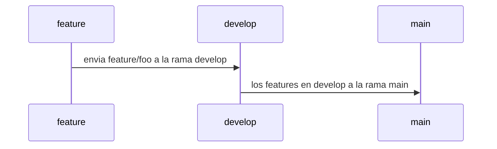

# SOCIAL OPLESK
### 🏴‍☠️ HACK-GROUP

<br/>

📚 docs [markdown 1](https://agea.github.io/tutorial.md/) | [markdown 2](https://docs.github.com/es/get-started/writing-on-github/getting-started-with-writing-and-formatting-on-github/basic-writing-and-formatting-syntax) | [archivos de salud](https://docs.github.com/es/communities/setting-up-your-project-for-healthy-contributions/creating-a-default-community-health-file)
---
📚 docs [comandos git](https://gist.github.com/dasdo/9ff71c5c0efa037441b6) | [conventional commit](https://www.conventionalcommits.org/en/v1.0.0/)
---

```diff
- NOTA HACER LAS PRÁCTICAS MEDIANTE LA CONSOLA DE VSCODE y GITHUB
```

```
Se tienen 4 alias (alfa, bravo, charlie, delta), cada alia representa un integrante del equipo, 
si tu equipo tiene un integrante extra se llamara (echo) el procedimiento a realizar es el siguiente,
se necesita crear un circulo hábil en el manejo del pull request y manejo de array, para tal fin. 

Los integrantes deben definir la asignación de los alias del circuito
El circuito inicia con el usuario alfa
```
```diff
* Tienen que crear 4 repositorios y 1 repositorio extra, solo si tienen a echo en el equipo.
* El usuario a cargo del circuito según el turno del alias, aceptara las solicitudes de pull request del equipo
* Definir un contenido en el README.md con la siguiente estrucutra:
  * (titulo con el alias del encargado del repo / tabla de integrantes donde se refleje el nombre, ubicación de cada integrante) 
  * (si deseas anexar más info al README.md, tienes la libertad de expresar tus ideas)
* Copie el fragmento de texto que esta contenido en el sector PULL_REQUEST_TEMPLATE en el archivo PULL_REQUEST_TEMPLATE.md
```
<br/>

|Hacks | Details | 
|----------|---------|
| H-1      | Hacks |
| H-2      | Close Pull Request |
| H-3      | Code Review | 

<br/> 

---

### WORKFLOW



---

PULL_REQUEST_TEMPLATE
# Tipo de usuario
- [ ] Alfa
- [ ] Bravo 
- [ ] Charlie
- [ ] Delta
- [ ] Echo

# Tecnología
- [ ] Python 
- [ ] Markdown

# Seleccione el tipo de actividad
- [ ] Feature
- [ ] Hotfix
- [ ] Refactor
- [ ] Performance
- [ ] Testing

---

|Alias  | 
|----------------------------------------------------------------------------------------------------
| foo, baz, charlie, qux, delta, quux, echo, corge, grault, garply, waldo, fred, plugh, xyzzy, thud, foobar |

<br/> 

---

#TIPS
```
    Los integrantes del proyecto deben hacer una actualización de su sucursal(repositorio) local
    git remote add upstream url_del_repositorio_foo
    git fetch upstream
    git switch main
    git merge upstream/main
 
    Cuando el encargado del repositorio este modo "code review" en el ambiente de main-test(rama local)
    seguir los pasos de forma estricta 
    git fetch origin pull/id_del_pull_request/head:nombreDelUsuario/nombre-de-la-feature-NÚMERO-DE-PR
    git switch main-test
    git merge nombreDelUsuario/nombre-de-la-feature-NÚMERO-DE-PR --no-commit
    git switch main  
    
    Conectar tú repositorio local, con el repositorio base
    git remote add upstream url_del_repositorio_base.git
    
    Si la escuadra quiere recibir los últimos cambios del repositorio base, realizar lo siguiente:
    git fetch upstream
    git merge upstream/main
```
---

## 🏆 H-1

#### 👽 Usuario (Hacks)
```sh
 1. Deben crear 1 repositorio principal por cada ciclo "hg_2_foo" foo es el nombre del usuario asignado, dentro del equipo
    de alias (alfa, bravo, charlie, delta, echo) como administrador del repositorio en ese momento del ciclo, más
    los archivos de README.md.
 
 2. (Foo) crea la rama develop y anexa un archivo PULL_REQUEST_TEMPLATE.md dentro del repositorio /docs,
    luego hacer merge con main
    
 3. (Foo) debe hacer una feature donde va a detallar el CODE_OF_CONDUCT.md tiene que estar en el mismo directorio
    de /docs ahora como debes crear el CODE_OF_CONDUCT.md acá tienes una dirección de ejemplo:
    https://github.com/auth0/open-source-template/blob/master/CODE-OF-CONDUCT.md

 4. (Foo) cuando el CODE_OF_CONDUCT.md este listo, tienes que integrar la feature a la rama develop y luego
    anexar los cambios al ambiente principal, que es la rama main
 
 5. Cada usuario debe enviar 1 directorio con su nombre de alias con 10 archivos de extensión ".py"
    /foo
    |---- hack1.py
    |---- hack2.py
    |---- hack3.py
    |---- hack4.py
    |---- hack5.py
    |---- hack6.py
    |---- hack7.py
    |---- hack8.py
    |---- hack9.py
    |---- hack10.py

    * RAMAS
    feature/alfa-hacks
    feature/bravo-hacks
    feature/charlie-hacks
    feautre/delta-hacks
    feature/echo-hacks
    
 5. (feature/foo-hacks) todos los integrantes de la escuadra, tienen que resolver los 10 hacks y enviarlos
     a la rama develop, como se específica en el punto 4.
     
     * HACK-1 
     //vaciar la lista
     [100,200,300,400,500,600,700]  result >  []  
     
     * HACK-2
     //eliminar el primer item
     [100,200,300,400,500,600,700]  result >  [200,300,400,500,600,700]  
     
     * HACK-3
     //eliminar el último item
     [100,200,300,400,500,600,700]  result >  [100,200,300,400,500,600]
     
     * HACK-4
     //eliminar los items 300 y 500
     [100,200,300,400,500,600,700]  result >  [100,200,400,600,700]
     
     * HACK-5 
     //clonar lista
     [100,200,300,400,500,600,700]  result >  [100,200,300,400,500,600,700]
     
     * HACK-6 
     //total item
     [100,200,300,400,500,600,700]  result > 7 
    
     * HACK-7 
     //remplazar el item 300 
     //por tú alias
     [100,200,300,400,500,600,700]  result >  [100,200,foo,400,500,600,700]

     * HACK-8 
     //agregar tú alias al final
     [100,200,300,400,500,600,700]  result >  [100,200,300,400,500,600,700,foo]
     
     * HACK-9
     //agregar tú alias al inicio
     [100,200,300,400,500,600,700]  result >  [foo,100,200,300,400,500,600,700]
     
     * HACK-10 
     //agregar después del item 500
     //los alias qux y thud
     [100,200,300,400,500,600,700]  result >  [100,200,300,400,500,qux,thud,600,700]

 6. (Foo) tiene la misión de integrar, cada directorio recibido en develop, al ambiente de producción main   
     resultado final a proyectar en el repositorio:
     
     /docs
     |----PULL_REQUEST_TEMPLATE.md
     |----CODE_OF_CONDUCT.md
     /alfa
     |---- con 10 archivos de hacks, listos
     /bravo
     |---- con 10 archivos de hacks, listos
     /charlie
     |---- con 10 archivos de hacks, listos
     /delta
     |---- con 10 archivos de hacks, listos
     /echo
     |---- con 10 archivos de hacks, listos
```     
 
---
## 🏆 H-2
#### 👽 (Close Pull Request)
```sh
7. Ahora cada participante envia una feature, con 1 archivo de extensión ".txt" con el nombre de su alias,
   esta feature la deben enviar directamente al ambiente principal(main), ahora el administrador del repositorio
   anula la solicitud pull request
 
8  Los participantes deben ir a la feature(rama) en su github y enviar la solicitud del PR a la dirección
   de desarrollo(develop) y el administrador integrar el PR al ambiente de desarrollo
```   

---

## 🏆 H-3
#### 👽 (Code Review)

```sh
10. Desde Oplesk enviamos (Felicitaciones a todos los integrantes de la escuadra), llegar a este punto, requiere de un 
    gran esfuerzo, compromiso y sobre todo, de un excelente trabajo de equipo.
 
11. Por último, la escuadra necesita crear un archivo con su alias "foo_log.py" en el archivo escribir:
    print(;)
    seguramente el vscode dará una alerta de error, aunque la intención es enviar un código con defecto  
 
12. (Foo) debe descargar cada solicitud de PR con el archivo de "foo_log.py"
     Busca el número de la Pull Request en GitHub y ve a la terminal, para descargar la feature de la
     solicitud del pull request y realizar el code review, en una rama de prueba main-test
     
     git fetch origin pull/id_del_pull_request/head:nombreDelUsuario/nombre-de-la-feature-NÚMERO-DE-PR
     git switch main-test
     git merge nombreDelUsuario/nombre-de-la-feature-NÚMERO-DE-PR --no-commit
     git switch main
 
13. (Foo) declina el PR, con el comentario que el código le falta un string dentro del print("string")
 
14. Los integrantes deben enviar la tarea devuelta con un texto dentro del print("foo") como recomendación
    enviar su alias.
 
15. (Foo) debe hacer los mismos pasos del punto 13. Si la feature enviada se encuentra estable, aceptar el PR.
    hacia la rama develop y luego enviar los cambios al ambiente de producción(main)
    consejo elimina las ramas nombreDelUsuario/nombre-de-la-feature-NÚMERO-DE-PR antes de realizar el "code review"
    del paso 13.
     
    git branch -D nombreDelUsuario/nombre-de-la-feature-NÚMERO-DE-PR
```
